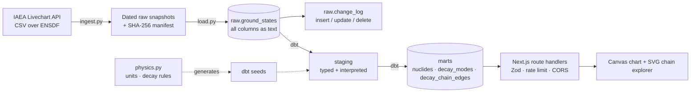

# Nuclide Explorer

An interactive chart of every known nuclide — 3,386 of them — built on the IAEA
Livechart API over [ENSDF](https://www.nndc.bnl.gov/ensdf/), the authoritative
international database of nuclear structure and decay data.

Protons up, neutrons across, coloured by decay mode or half-life. Click any
nuclide to walk its decay chain to stability.

**[Live demo](https://nuclide-explorer.vercel.app)** · [Data source](https://nds.iaea.org/relnsd/vcharthtml/api_v0_guide.html)

---

## What it does

- **Nuclide chart** — all 3,386 nuclides on one canvas, with zoom, pan, and
  filtering by element, stability, decay mode, and half-life range. Magic-number
  shell closures (2, 8, 20, 28, 50, 82, 126) are drawn as guides.
- **Decay-chain explorer** — walks any nuclide to its stable end state,
  rendering the result as a graph. Chains branch and re-converge: Bi-212 splits
  64% β⁻ / 36% α and both paths land on Pb-208.
- **Public JSON API** — filterable list, per-nuclide detail, and recursive
  chain traversal.

## Architecture



`physics.py` is the single source of truth for unit factors and decay rules;
the dbt seeds are generated from it, and CI fails if they drift apart.

## Tech stack

| Layer | Choice | Why |
|---|---|---|
| Ingestion | Python + `requests` | Small, dependency-light, easy to schedule |
| Raw storage | Dated flat files + `raw` schema | Diffable; keeps IAEA's bytes untouched |
| Transformation | dbt (postgres) | Testable, documented, layered SQL |
| Database | Neon Postgres | Free tier, scales to zero, native Vercel integration |
| API | Next.js route handlers | Same deployment unit as the frontend |
| Validation | Zod | Every route parameter parsed before it reaches SQL |
| Frontend | Next.js 16, React 19, Tailwind 4 | — |
| Chart | Canvas 2D + `d3-zoom` | 3,386 SVG nodes re-styled per zoom frame is where generic chart libraries stall |
| Hosting | Vercel | — |

## What the data actually looks like

Most of the engineering here is in the gap between what the API returns and
what a usable schema needs. The pipeline exists because of these:

**`half_life` is not a number.** It holds floats, the string `STABLE`, a literal
`?`, and blanks. Three of those leave IAEA's own precomputed `half_life_sec`
column empty while meaning entirely different things — *stable*, *exists but
never measured* (Mo-82), and *nothing known*. So `stability` is a three-state
flag, not a boolean, and the half-life is recomputed from the published value
and unit rather than read from the convenient column.

**`unit_hl` mixes time with energy.** Thirteen units spanning attoseconds to
years, plus `eV`/`keV`/`MeV` — resonance *widths*, converted to lifetimes via
t½ = ħ ln2 / Γ. And `m` is **minutes**, not milliseconds; treating it as
"milli" would be a silent factor-of-60,000 error on 548 nuclides.

**166 half-lives are bounds, not measurements.** `operator_hl` carries `LT`,
`GT`, `GE`, or `AP`. Dropping that column turns "< 2.6 MeV" into a fact.

**Decay data is wide; the graph needs it tall.** `decay_1..decay_3` become one
row per branch. 1,460 nuclides have a second branch and 334 a third, so a decay
"chain" is really a tree.

**Two decay modes have no daughter.** Spontaneous fission produces a
distribution of fragments, and isomeric transition leaves the nuclide unchanged
— a self-loop that would make the recursive walk run forever. Both terminate
the chain, and the API guards depth and revisits regardless.

**Heavy nuclei emit whole nuclei.** Ra-226 sheds an entire ¹⁴C at a branching
ratio of 3.2×10⁻⁹%. These arrive as `14C`, `24NE`, and — when ENSDF's
superscript markup leaks through — `{+22}Ne`, plus one bare `Mg` with no mass
number, which is recorded as indeterminate rather than guessed. Cluster daughters
are parsed from the code itself, so a species IAEA publishes later still
resolves. Every one of them lands on or beside doubly-magic Pb-208.

**A trailing blank line.** The CSV ends with one; a naive parser gains a junk
nuclide.

## Verification

Our recomputed half-lives are checked against IAEA's own `half_life_sec` for
every nuclide, to a relative tolerance of 1e-6. The residual is real and
explained: IAEA derives width-based half-lives with the CODATA 2006 value of ħ,
this pipeline uses CODATA 2018 — a difference of ~1 part in 10⁷.

The U-238 chain reproduces the textbook uranium series in 14 steps to stable
Pb-206.

## Running it

```bash
git clone https://github.com/sayedomarhashimi/nuclide-explorer
cd nuclide-explorer
cp .env.example .env        # fill in your Postgres connection details

python3 -m venv .venv && .venv/bin/pip install -r pipeline/requirements.txt
.venv/bin/python pipeline/refresh.py      # ingest -> load -> dbt run -> dbt test

cd web && npm install && npm run dev
```

`pipeline/refresh.py` is idempotent. It hashes the upstream payload and exits
early when nothing has changed, so it is safe to run on a schedule; the GitHub
Actions workflow runs it monthly, which matches the pace at which ENSDF
evaluations are actually published. When the payload does change, the diff is
written to `raw.change_log` with the specific columns that moved.

## API

| Route | Description |
|---|---|
| `GET /api/nuclides` | Filter by `zMin`/`zMax`, `nMin`/`nMax`, `element`, `stability`, `decayMode`, `halfLifeLogMin`/`Max`, `limit`, `offset` |
| `GET /api/nuclides/:id` | Full detail, decay branches, and known parents. `:id` looks like `u-238` |
| `GET /api/decay-chain/:id` | Recursive walk to stability. `maxDepth` (1–60), `minBranchingPct` |
| `GET /api/health` | Row count and last refresh time |

## Security

- Every route parameter is parsed by a Zod schema before reaching the database;
  unknown query keys are rejected rather than ignored.
- All SQL uses bind parameters. No user input is ever concatenated into a
  statement — filters are assembled as numbered placeholders only.
- Rate limiting on every route, keyed per route *and* caller so a cheap
  endpoint cannot exhaust an expensive one's budget. (In-process state; see the
  note in `lib/rateLimit.ts` about what that means on serverless.)
- CSP with a per-request nonce and `strict-dynamic`, set in `proxy.ts`. A static
  CSP would need `unsafe-inline` for Next's hydration scripts, which defeats
  most of the point.
- `X-Frame-Options`, `X-Content-Type-Options`, `Referrer-Policy`,
  `Permissions-Policy`, and HSTS set in `next.config.ts`. `X-Powered-By` removed.
- CORS is an explicit allow-list from `ALLOWED_ORIGINS`, never a wildcard.
- Recursive chain queries are bounded on depth and carry a path-based cycle
  guard, so no request can walk forever.
- `npm audit` clean. CI fails on high or critical advisories, and a secret-scan
  job greps every commit for credential-shaped strings.

## Tests

| Suite | Count | Covers |
|---|---|---|
| `pytest` | 49 | Unit conversions, stability states, decay rules, cluster parsing, CSV quirks |
| `dbt test` | 30 | Referential integrity, accepted values, uniqueness, half-life agreement with IAEA, no unmapped modes, no self-edges |
| `node --test` | 14 | Zod schemas, rate limiter, client identification |

The most valuable of these is `assert_no_unmapped_decay_modes`: it fails if
IAEA publishes a decay mode the pipeline has no rule for. It caught 20 of them
on the first run.

## Licence

Code is MIT. The underlying nuclear data is produced by the IAEA Nuclear Data
Section and the ENSDF evaluators; please cite them, not this repository.
